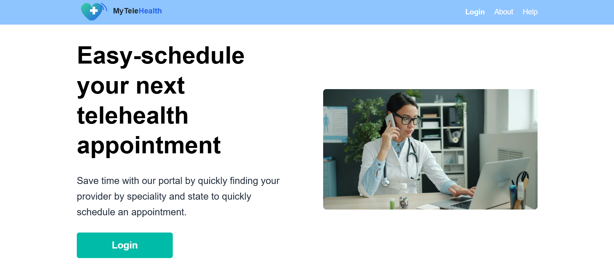

# 🏥 Telehealth Scheduling App

A full-stack telehealth scheduling platform that allows patients to search for providers, book appointments, and manage schedules, while providers can view and manage their availability through a dashboard.

## What it does

Full-stack scheduling platform with role-based portals for patients and providers. Patients search by specialty and state, view live availability, and confirm bookings. Providers manage calendars and patient queues through a dedicated dashboard — all backed by a serverless PostgreSQL database and Prisma ORM.

## 🚀 Live Demo

🔗 [https://telehealth-demo-lovat.vercel.app](https://telehealth-demo-lovat.vercel.app)

## 🧠 Tech Stack

**Frontend**
* Next.js 15 (App Router)
* React
* TypeScript
* Tailwind CSS

**Backend**
* Next.js API Routes
* Prisma ORM

**Database**
* PostgreSQL (hosted on Neon)

**Deployment**
* Vercel (Frontend + Serverless API)
* Neon (Serverless PostgreSQL Database)

## ✨ Features

**👤 Patient**
* Search providers by specialty and state
* View provider availability
* Book appointments
* Login system with validation

**🩺 Provider**
* Provider dashboard
* Calendar view of appointments
* View booked patients
* Manage availability

## 🔐 Demo Login Credentials

**Patient Accounts**

| Email | Password |
|---|---|
| patient1@test.com | password123 |
| patient2@test.com | password123 |
| patient3@test.com | password123 |

**Provider Accounts**

| Email | Password |
|---|---|
| provider1@test.com | password123 |
| provider2@test.com | password123 |
| provider3@test.com | password123 |

## ⚙️ Environment Setup

Create a `.env` file in the root directory:

```
DATABASE_URL="your_neon_postgres_connection_string"
```

## 🛠️ Local Development

Install dependencies:

```bash
npm install
```

Push Prisma schema:

```bash
npx prisma db push
```

Seed database:

```bash
npx prisma db seed
```

Run development server:

```bash
npm run dev
```

## 📦 Deployment

This project is deployed using:

* Vercel for hosting
* Neon for database

Make sure to set the following environment variable in Vercel:

```
DATABASE_URL=your_neon_postgres_connection_string
```

## 🧩 Architecture Overview

* Serverless API routes handle authentication and data fetching
* Prisma manages database queries and schema
* PostgreSQL provides scalable, production-ready data storage
* Tailwind CSS ensures responsive UI across devices

## 🎯 Future Improvements

* Authentication with JWT or NextAuth
* Real-time availability updates
* Email notifications for bookings
* Admin dashboard
* Pagination & filtering enhancements

## 👨‍💻 Author

Christopher Mattox — Frontend Developer

* GitHub: [https://github.com/cmattox1983](https://github.com/cmattox1983)
* LinkedIn: [https://linkedin.com/in/christopher-p-mattox](https://linkedin.com/in/christopher-p-mattox)

## 📌 Notes

* This project uses a serverless PostgreSQL database (Neon) instead of SQLite for production readiness.
* Prisma ORM is used for type-safe database interactions.
* Designed to simulate a real-world healthcare scheduling system.
